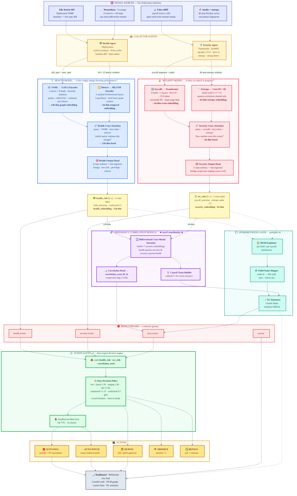

# KubeHeal v4.0

**Autonomous Configuration & Security Drift Correction in Kubernetes**

RVCE · Unisys "Agents Unleashed" · UIP · Mentor: Dr. Mohana
Team: Ryan Dave Fernandes · P Koti Darshan · Rakshak S

---

KubeHeal detects and autonomously heals two simultaneous production crises in
Kubernetes — **configuration drift** (a CPU limit silently set to 50m instead
of 500m) and **container ransomware** (high-entropy mass file encryption on a
PersistentVolume) — and acts in **<8s** for critical threats.

v4 splits the v3 DIT-Sec monolith into **two specialized models + a Dependency
Correlation Module (DCM) + an Interpretation Layer**.



> Full layer-by-layer walkthrough: **[docs/architecture-flow.md](docs/architecture-flow.md)**

---

## The v4 architecture

```
YAML diff + Prom metrics ─► HEALTH MODEL  (GATv2 + BiLSTM)   ─► health_risk + 128-dim emb ┐
Falco syscalls + entropy ─► SECURITY MODEL (Transformer + Conv1D-SE) ─► sec_risk + 64-dim ┤
                                       both embeddings ─► DCM ─► correlation_score ────────┤
                                       all signals ─► INTERPRETATION ─► SHAP + NL summary  │
                                       all signals ─► FUSION AGENT (3-signal policy) ◄──────┘
                                                       └► AUTO-KILL / AUTO-PATCH / HUMAN / OBSERVE / BENIGN
```

| Model | Inputs | Encoders | Output |
|-------|--------|----------|--------|
| **Health** (`models/health_model/`) | YAML diff + 60×15 metrics | GATv2 (3L×8h) + BiLSTM (2L) → cross-attn | `health_risk`, 4-class label, field attribution, conformal CI, 128-dim emb |
| **Security** (`models/security_model/`) | ≤256 syscalls + 30-step entropy | Transformer (4h×2L, Pre-LN, CLS) + Conv1D-SE (k=3·7·15) → cross-attn | `sec_risk`, 5-class label, syscall attribution, entropy spike, CI, 64-dim emb |
| **DCM** (`models/dcm/`) | both embeddings | bidirectional cross-modal attention | `correlation_score`, `compound_flag`, causal chain |

---

## Decision policy (Fusion Agent v4)

`agents/fusion_agent/decision_policy.py` — pure, fully unit-tested function.

| Condition | Action |
|-----------|--------|
| compound + `sec_adj ≥ 0.85` | **AUTO-KILL** (compound) |
| `sec_adj ≥ 0.85` (security only) | **AUTO-KILL** |
| `health_adj ≥ 0.85` and `sec_risk < 0.4` | **AUTO-PATCH** (canary) |
| `max(adj) ≥ 0.65` | **HUMAN** approval |
| `max(adj) ≥ 0.40` | **OBSERVE** |
| else | **BENIGN** |

`adj = risk × tier(prod 1.20 / staging 1.00 / dev 0.70) × (compound? 1.15 : 1)`.
Wide conformal CI (>0.15) or a tripped circuit breaker routes to human.
Burn-in mode raises thresholds until 2000 metric samples exist.

---

## Project structure

```
agents/
  health_agent/    agent.py · prometheus_client.py (fresh-metric cache)
  security_agent/  agent.py · proc_scanner.py (cgroups v1/v2 + LRU)
  fusion_agent/    agent.py (3-signal) · decision_policy.py · incident_lock.py (heartbeat)
models/
  health_model/    yaml_gat_encoder · metric_bilstm_encoder · health_fusion_attention
                   · health_output_head · health_model · health_conformal
                   · dit-merged-complete.csv (real training data) · checkpoints/
  security_model/  falco_transformer_encoder · entropy_conv1d_encoder
                   · security_fusion_attention · security_output_head · security_model · checkpoints/
  dcm/             cross_modal_attention · causal_chain_builder · correlation_head · checkpoints/
  interpretation/  shap_explainer · field_name_mapper · nl_summary_generator
  train_health_model.py · train_security_model.py · train_dcm.py
  generate_security_training_data.py
services/
  health_model_server/  (FastAPI :8001)
  security_model_server/ (FastAPI :8002)
  dcm_server/            (FastAPI :8003)
k8s/   health-model · security-model · dcm deployments · secrets template · rbac · crds
tests/ test_decision_policy.py (25) · test_cgroups_compatibility.py · test_encoders.py
docs/  architecture-flow.mmd · .md · .png
```

---

## Quick start (local)

```bash
python -m venv .venv && source .venv/bin/activate
pip install -r requirements.txt          # torch, torch-geometric, shap, anthropic, fastapi …

# run the three model servers (loads trained checkpoints if present, else random weights)
PYTHONPATH=. python services/health_model_server/main.py     # :8001
PYTHONPATH=. python services/security_model_server/main.py   # :8002
PYTHONPATH=. python services/dcm_server/main.py              # :8003

# run the test suite
PYTHONPATH=. pytest tests/ -q
```

Kubernetes deploy: `./scripts/install.sh` (Minikube + Redis Sentinel +
Prometheus + agents + the 3 model servers).

---

## Training the models — run these (do NOT auto-run; GPU strongly preferred)

> Real ransomware traces need a live Falco cluster; the security generator
> synthesises behaviorally-faithful samples for offline training. The health
> model trains on the **real** drift CSV already in the repo.

```bash
# 0. (Windows GPU) install CUDA torch first:
#    pip install torch==2.2.0 --index-url https://download.pytorch.org/whl/cu121
#    pip install torch-geometric torch-scatter torch-sparse -f https://data.pyg.org/whl/torch-2.2.0+cu121.html

# 1. Health Model — real data (models/health_model/dit-merged-complete.csv)
PYTHONPATH=. python -u models/train_health_model.py \
    --epochs 30 --batch-size 16 --patience 6

# 2. Security training data (synthetic, fast)
PYTHONPATH=. python models/generate_security_training_data.py \
    --output data/security_training.jsonl

# 3. Security Model
PYTHONPATH=. python -u models/train_security_model.py \
    --data data/security_training.jsonl --epochs 25 --batch-size 32 --patience 5

# 4. DCM — staged, AFTER 1 & 3 (freezes both base models)
PYTHONPATH=. python -u models/train_dcm.py --epochs 25 --batch-size 32

# 5. (optional) recalibrate conformal on a held-out set
PYTHONPATH=. python models/calibrate_conformal.py --coverage 0.90

# 6. validate promotion gates (F1 / AUROC; latency advisory)
PYTHONPATH=. python models/validate_all_models.py

# 7. export for serving — security/DCM → FP16 ONNX, health → torch bundle
PYTHONPATH=. python models/export_security_model.py --quantize fp16
PYTHONPATH=. python models/export_dcm.py --quantize fp16
PYTHONPATH=. python models/export_health_model.py

# 8. (optional) push to the MinIO model registry
PYTHONPATH=. python models/upload_to_registry.py --version v4.0.0
```

Outputs land in `models/<model>/checkpoints/best_*.pt` + `*_conformal.json` +
`*_report.json`. The servers auto-load the checkpoints on startup.

> ONNX note: the security and DCM models export to **FP16 ONNX** (validated;
> falls back to FP32 if a graph op rejects FP16). The health model serves via
> torch — its GATv2 over a *variable* YAML graph isn't ONNX-exportable, so
> `export_health_model.py` emits a validated torch bundle instead.

**GPU note:** GATv2 builds one graph per sample in Python — CPU runs ~minutes
per epoch; a GPU (RTX 3060+) finishes each model in minutes.

---

## API contracts (Section 13)

| Server | Endpoint | Returns |
|--------|----------|---------|
| Health :8001 | `POST /health/score` | risk, label, label_probabilities, ci, field_attention_weights, top_field/metric, **health_embedding[128]** |
| Security :8002 | `POST /security/score` | risk, label, ci, syscall_attention_weights, top_syscall, entropy_spike, **security_embedding[64]** |
| DCM :8003 | `POST /dcm/correlate` | correlation_score, compound_flag, causal_chain, nl_summary |

All three expose `GET /health` for K8s probes.

---

## Re-render the architecture diagram

```bash
npx -y @mermaid-js/mermaid-cli -i docs/architecture-flow.mmd -o docs/architecture-flow.png -s 2 -b transparent
```

---

## License

RVCE · Unisys UIP · Confidential
