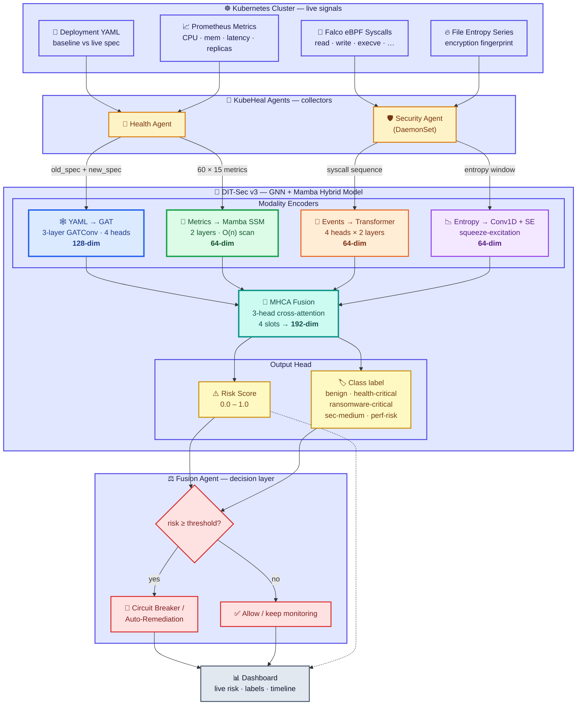

# KubeHeal — DIT-Sec v3 (GNN + Mamba) Architecture & Project Flow

This diagram shows two things at once:
1. **How the DIT-Sec v3 model works internally** (GNN + Mamba + Transformer + Conv1D → fusion → risk/label).
2. **How the model is used end-to-end in the KubeHeal project** (cluster signals → agents → model → decision → dashboard).

## Legend

| Color | Component | Role |
|-------|-----------|------|
| 🟦 Blue | **GNN (GAT)** | YAML diff → attributed graph → 3-layer Graph Attention Network → 128-dim |
| 🟩 Green | **Mamba SSM** | Prometheus metric time-series → O(n) state-space scan → 64-dim |
| 🟧 Orange | **Transformer** | Falco syscall sequence → 4-head × 2-layer encoder → 64-dim |
| 🟪 Purple | **Conv1D + SE** | File entropy series → conv + squeeze-excitation → 64-dim |
| 🟦‍🟩‍🟧‍🟪 → Teal | **MHCA Fusion** | Cross-attention over the 4 modality embeddings → 192-dim |
| 🟨 Gold | **Output Head** | Risk score (0–1) + 5-class label |
| 🟥 Red | **Fusion Agent** | Thresholds risk → circuit-breaker / auto-remediation or allow |

## Notes
- **Modality routing**: the health path uses YAML + metrics; the security path uses syscalls + entropy. Any missing modality is zero-filled, so the same single model serves both domains.
- **One model, two domains**: there is exactly one network (`DITSecV3`, ~436K params) with one shared fusion layer and one output head spanning all 5 classes.
- Source: [models/dit_sec_v3/dit_sec_v3_model.py](../models/dit_sec_v3/dit_sec_v3_model.py).
